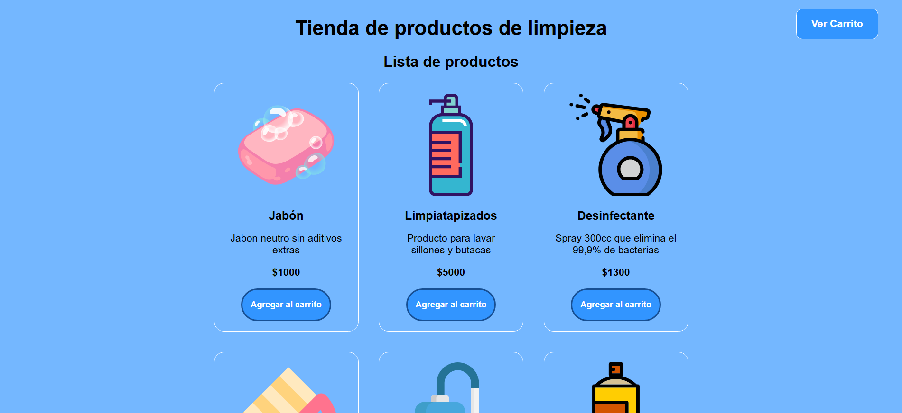

# Limpialoom Store

Limpialoom Store es un ecommerce ficticio de productos de limpieza desarrollado como práctica de desarrollo frontend utilizando HTML, CSS y JavaScript.

La aplicación permite explorar distintos productos, agregarlos a un carrito de compras y simular una experiencia básica de tienda online desde el navegador.

## Preview

## Demo

🌐 https://limpialoom-store.vercel.app/

## Características

- Catálogo dinámico de productos
- Carrito de compras interactivo
- Agregado y eliminación de productos
- Actualización automática del total
- Diseño responsive
- Interfaz visual moderna y simple
- Navegación intuitiva

## Tecnologías utilizadas

- HTML5
- CSS3
- JavaScript

## Librerías y herramientas

- Bootstrap 5
- Bootstrap Icons
- Google Fonts
- SweetAlert2
- Vercel
